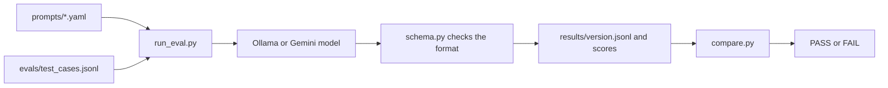

# Prompt Release Safety Gate

A small test setup that checks whether a change to an AI prompt makes a feature better or worse, and prints PASS or FAIL. See [REPORT.md](REPORT.md) for the results.

## How it works



## Setup (Windows)
1. Install Python 3.11+ and [Ollama](https://ollama.com/download).
2. Download the model: `ollama pull llama3.2:3b`
3. Create and activate an environment, then install the libraries:
```
python -m venv venv
venv\Scripts\activate
pip install -r requirements.txt
```

## Run
Score a prompt (results are saved, so a stopped run continues where it left off):
```
python run_eval.py --prompt prompts/v1.yaml
```
Compare two versions and get PASS or FAIL:
```
python compare.py v1 v2
```

## Add test cases
Add one line per case to `evals/test_cases.jsonl`, then check the file:
```
python check_cases.py
```
Each line needs `id`, `note`, `expected_sentiment` (positive, neutral, negative), `expected_urgency` (low, medium, high) and `difficulty` (easy, medium, hard).

## Change the gate rules
Edit the two numbers at the top of `compare.py`.

## Files
- `prompts/` holds the prompt versions (v1, v2, and a deliberately bad v3).
- `schema.py` defines the allowed output format.
- `feature.py` sends a note to the model.
- `run_eval.py` runs and scores a prompt on all test cases.
- `compare.py` compares two versions and decides PASS or FAIL.
- `results/` holds saved answers, scores and comparison reports.

Never commit your `.env` file. It is listed in `.gitignore`.